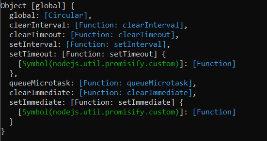
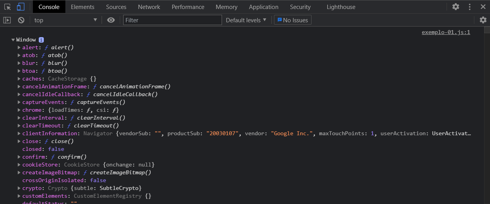

O _this_ pra mim foi uma das partes mais confusas de entender quando comecei a estudar JavaScript, acho que foi tão difícil de entender por 2 motivos:

1.  Quando eu tinha dúvidas não tinha pra quem perguntar.
2.  As explicações que eu encontrava eram muito simples, na base do `foo = "foo"`, e no final acabavam mais me confundindo do que me ajudando.

Por isso decidi escrever esse artigo, pra explicar o _this_ do jeito que eu queria que tivessem me explicado quando eu estava aprendendo.

Acho que o que fica mais confuso no começo é que cada hora o _this_ tem um valor diferente, então vou explicar o pq disso com alguns exemplos. O _this_ é uma palavra reservada do JS, com ele você consegue ter acesso a algumas propriedades do contexto onde ele está inserido.

Vamos executar esse trecho de código e ver o que acontece:

```js
function example() {
  return this
}

console.log(example())
```

Se você executar esse script pelo node o valor retornado é o globalThis:



Agora se você executar esse mesmo script no browser, o valor do this muda, pq o contexto mudou. Criei um arquivo HTML, importei esse script e abri o arquivo no browser, esse foi o valor que apareceu no console:



No contexto do browser, esse _this_ é o objeto Window.

Mas pq? Pq o valor do _this_ muda de acordo com o contexto onde ele é chamado. E nesse primeiro exemplo a gente tá acessando o _this_ em um contexto global, ele não tá dentro de nenhum objeto, função ou evento, então o ambiente onde esse arquivo é executado é que define o valor do _this_.

Então se esse _this_ estivesse dentro de uma função/evento o valor seria diferente? Sim, e dependeria apenas do contexto onde a gente inseriu ele, e não mais do ambiente onde o arquivo foi executado. Vou mostrar alguns exemplos.

# objeto + função

O _this_ sendo chamado dentro de uma função que faz parte de um objeto:

```js
const example = {
  name: "Evellyn",
  getName: function() {
    console.log(this.name)
  },
}

example.getName() // a saída será: "Evellyn"
```

Nesse caso o _this_ faz referência ao objeto no qual a função está inserida e por isso quando printamos `this.name` o valor exibido é "Evellyn", que é o valor que foi definido na chave _name_ desse objeto onde o _this_ foi executado.

# strict mode

Se o nosso código estiver rodando no _strict mode_ as coisas mudam um pouco.

Quando nosso código estiver rodando nesse modo, o _this_ chamado fora de um contexto terá o valor de _undefined_ ao invés do valor globalThis (node) ou da Window (browser).

```js
"use strict"

function example() {
  return this
}

console.log(example()) // undefined
```

# bind

Nós podemos mudar o contexto do _this_ conforme a nossa necessidade também, pra fazer isso podemos usar um método chamado _bind_, a documentação do JS diz que "O método bind() cria uma nova função que, quando chamada, tem sua palavra-chave this definida para o valor fornecido."

```js
const getName = function() {
  return this.name
}

const myInfo = {
  name: "Evellyn",
}

const otherPersonInfo = {
  name: "Nome aleatório",
}

const myName = getName.bind(myInfo)
const notMyName = getName.bind(otherPersonInfo)

console.log(myName()) // "Evellyn"
console.log(notMyName()) // "Nome aleatório"
```

Como podemos ver no exemplo acima, o valor do _this_ muda de acordo com o contexto que é passado para ele pelo método _bind_. Mas como isso acontece? Ao usar o _bind_ a engine do JS cria uma nova instância do método `getName` e define a variável passada por parâmetro como referência pro _this_.

# arrow function

Dentro de uma arrow function o _this_ faz referência ao escopo onde essa função foi criada. No nosso exemplo o _this_ dentro da função `example` e dentro do `objectExample` representam o valor da Window pq o escopo no qual essas funções foram criadas é o escopo global.

```js
const example = () => {
  console.log("example: ", this) // objeto Window do browser
}

const objectExample = {
  name: "Evellyn",
  getThis: () => {
    return console.log("objectExample: ", this) // objeto Window do browser
  },
}

example()
objectExample.getThis()
```

Mas se a gente criar uma função tradicional e dentro dela definirmos uma variável e tentarmos pegar ela com o this nós vamos conseguir, pq? Pq a arrow function foi criada dentro do contexto dessa função.

```js
function Person() {
  this.age = 25
  this.sayAge = () => {
    console.log(this.age)
  }
}

const person = new Person()
person.sayAge() // 25
```

Além dessas mudanças, com arrow function nós não conseguimos mudar o valor do _this_ como fizemos com o uso do _bind_ no exemplo acima, nem conseguimos ter acesso ao objeto no qual o _this_ está inserido como fizemos no primeiro exemplo pq dentro de uma arrow function nós não temos a chave _this_.

# conclusão

O _this_ pode causar bastante confusão no seu código, e na sua cabeça, então sempre que for usar ele e não souber exatamente o que está acontecendo é importante você ler a documentação, ou procurar uma resposta em alguma fonte confiável ou colega/amigo, pra entender se está usando ele da maneira correta e garantir que isso não vai causar algum comportamento inesperado na sua aplicação.
