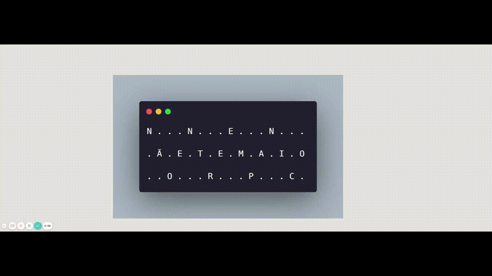

**Update:** Fiquei entre os 300 primeiros 🎉🎉🎉

---

Faz uns 4 anos que participo do Code Your Way do Ebanx, a ideia do evento é resolver alguns desafios técnicos pelo HackerRank dentro de um tempo pré-determinado - nesse ano eram 6 desafios para serem resolvidos em 1h30. As pessoas que ficarem entre os 500 primeiros no ranking final ganham uma camiseta exclusiva do evento.

Eu gosto de fazer esses desafios porque normalmente os problemas são bem diferentes dos que vejo no dia a dia, então é uma boa oportunidade pra fazer coisas diferentes e descobrir novas técnicas, esse é um jeito divertido de evoluir tecnicamente.

Resolvi postar essa solução aqui porque não consegui terminar ela dentro do tempo proposto mas sabia que tava quase terminando, então terminei de construir a solução depois só pra confirmar que meu raciocínio tava no caminho certo.

### Problema apresentado no HackerRank

Você está participando de uma competição cuja premiação é uma camiseta irada, infelizmente, está acabando o tempo e você não está conseguindo terminar a última questão. Para tentar aumentar suas chances, você decidiu "consultar" o trabalho de um de seus colegas enquanto ele não estava olhando. Porém, analisando as anotações dele, está tudo criptografado. Frustrado, você continua procurando e acha o seguinte rascunho que dá pistas de como as mensagens são criptografadas.

**Pista 1:**

Mensagem / Cifra: NÃOENTREEMPANICO / 3

N...N...E...N...  
.Ã.E.T.E.M.A.I.O  
..O...R...P...C.

Mensagem criptografada: NNENÃETEMAIOORPC

**Pista 2:**

Mensagem / Cifra: PAREDEBISBILHOTAR / 4

P.....B.....H....  
.A...E.I...L.O...  
..R.D...S.I...T.R  
...E.....B.....A.

Mensagem criptografada: PBHAEILORDSITREBA

Com base nisso, escreva um programa que com base na mensagem e na cifra, **consegue criptografar a mensagem**.

Exemplo:

**Entrada (Input):**

NÃOENTREEMPANICO / 3

**Saída (Output):**

NNENÃETEMAIOORPC

### **Solução**

Antes de mostrar a minha solução vou explicar qual foi a minha ideia, acho que assim fica mais fácil de entender o código.

Como a solução final dependia do número de linhas passadas no input eu pensei em criar um array de linhas e dentro desse array colocar cada linha como um novo array (agora um array de carácteres). Com isso eu consigo andar pelas linhas, descendo e subindo:



A minha solução final ficou assim:

```js
// encrypted_input = 'NÃOENTREEMPANICO / 3'
function decode_message(encrypted_input) {
  // função pra gerar os array's de carácteres
  const generateLines = num => {
    let lines = []

    for (let i = 0; i < num; i++) {
      lines.push([])
    }

    return lines
  }

  // informações passadas no input
  const message = encrypted_input.split(" / ")[0].split("") // frase: NÃOENTREEMPANICO
  const lines = encrypted_input.split(" / ")[1] // número de linhas: 3

  // array de linhas
  const linesArray = generateLines(lines)

  // aqui tem algumas variáveis que ajudam na lógica da solução
  let lastWrite = null // variável usada preu saber qual foi a última linha que teve uma letra adicionada
  let lineToWrite = null // variável preu saber em qual linha eu vou escrever a letra agora
  let signal = "plus" // variável preu saber se preciso "subir" ou "descer" pelas linhas

  // enquanto o message tiver caracteres esse código vai ser executado
  while (message.length > 0) {
    // se a variável que informa qual foi a última linha que teve uma letra inserida estiver como NULL significa que estamos escrevebdo a primeira letra
    if (lastWrite === null) {
      // então a linha em que preciso escrever a primeira letra da frase com certeza é a linha 0
      lineToWrite = 0
    } else {
      // agora que a lastWrite está preenchida preciso criar uma lógica pra construir a mensagem criptografada

      // variável onde salvo qual é o número da linha que precisa ter a letra inserida nessa iteração do while
      let newLineToWrite = null

      // antes de definir a variável newLineToWrite preciso saber se estamos descendo na linha (+) ou se estamos subindo (-) pra então definir a linha correta
      if (signal === "plus") {
        // aqui estamos descendo
        newLineToWrite = lineToWrite + 1
      } else {
        // aqui estamos subindo
        newLineToWrite = lineToWrite - 1
      }

      // aqui verificamos se estamos na última ou na primeira linha, se estivermos em uma das duas precisamos mudar a variável signal e então inverter a nossa direção de escrita
      if (newLineToWrite + 1 === linesArray.length || newLineToWrite === 0) {
        signal =
          signal === "plus" // se a variável signal esta como plus então estamos descendo na linha
            ? "minus" // por isso mudamos ela pra minus, assim eu sei que precisamos começar a subir pelas linhas
            : "plus" // se a signal está como minus mudamos ela pra plus de novo e voltamos a descer pelas linhas
      }

      // e aqui definimos qual linha deve ter a letra escrita dessa vez
      lineToWrite = newLineToWrite
    }

    // nesse for passamos por todas as linhas que criamos lá no início da nossa função
    for (let i = 0; i < linesArray.length; i++) {
      // validamos se a linha atual dessa iteração é igual a linha que devemos escrever a letra atual
      if (i === lineToWrite) {
        // se for a linha certa pegamos a primeira letra da variável onde está nossa mensagem original e adicionamos ela a essa linha
        linesArray[i].push(message[0])
      } else {
        // se não for a linha que deve ter a letra escrita então simplesmente adicionamos um ponto nela
        linesArray[i].push(".")
      }
    }

    // aqui marcamos qual linha foi escrita agora
    lastWrite = lineToWrite

    // e removemos a primeira letra da variável message, afinal ela já foi adicionada na linha correta
    message.shift()
  }

  let encryptedMessageWithLines = ""

  // depois de finalizar todo o array de linhas e carácteres eu passo por cada linha transformando ela em uma string
  for (let i = 0; i < linesArray.length; i++) {
    // pego a linha atual e junto os carácteres que estavam separados num array transformando essa linha em uma string
    const stringLine = linesArray[i].join("")

    const firstLine = stringLine

    // aqui eu tô só adicionando uma quebra de linha entre a linha existente na mensagem criptograda e a nova linha a ser adicionada
    const otherLines = `${encryptedMessageWithLines}\n${stringLine}`

    // a mensagem final criptografada começa a ser construída aqui:
    encryptedMessageWithLines = encryptedMessageWithLines
      ? otherLines // se essa variável encryptedMessageWithLines não estiver vazia eu adiciono a variável que juntou o valor atual da encryptedMessageWithLines + a linha atual
      : firstLine // se a encryptedMessageWithLines está vazia então eu só preciso adicionar a primeira linha (que é simplesmente a linha atual da iteração)

    // a variável encryptedMessageWithLines fica assim:
    // N...N...E...N...
    // .Ã.E.T.E.M.A.I.O
    // ..O...R...P...C.
  }

  // aqui eu tô gerando a mensagem criptografada que é esperada, tô removendo daquela string todas as quebras de linha e os pontos entre as letras
  let encryptedFinalMessage = encryptedMessageWithLines
    .replace(/\n/g, "") // remove as quebras de linha (/n)
    .replace(/\./g, "") // remove os pontos (.)

  // e por fim eu retorno a mensagem criptografada: NNENÃETEMAIOORPC
  return encryptedFinalMessage
}
```

Eu sei que esse código poderia ser bem melhor, com uma organização mais estruturada, os nomes das variáveis poderiam ser mais claros, o código poderia ser mais simples e etc. A minha ideia aqui foi simplesmente mostrar como ficou a minha primeira solução, então não fazia sentido eu refatorar tudo e trazer aqui uma solução bem mais estruturada.

Eu assumo que durante esses challenges o ideal é fazer seu código organizado o bastante pra você não se perder enquanto ta escrevendo ele, mas ele não precisa ter todo aquele cuidado que é necessário quando estamos codando em projetos que outras pessoas irão mexer, que precisam escalar e que precisam ser manuteníveis. Como nesse challenge o tempo conta muito eu acabo entregando apenas a solução que funciona.

---

Esse foi um problema que quando eu li o enunciado pela primeira vez confesso que não fazia a menor ideia de como resolver, depois de pensar um pouco acabei chegando nessa solução construída em cima de arrays, não sei se essa foi a melhor solução (spoiler: provavelmente não foi), mas foi uma solução que funcionou.

Depois de terminar challenges do tipo eu gosto de olhar de novo como ficou minha solução e pensar em como poderia ser melhor, algumas vezes acabo refatorando e melhorando o código pra ver quanto eu consigo evoluir ele.
