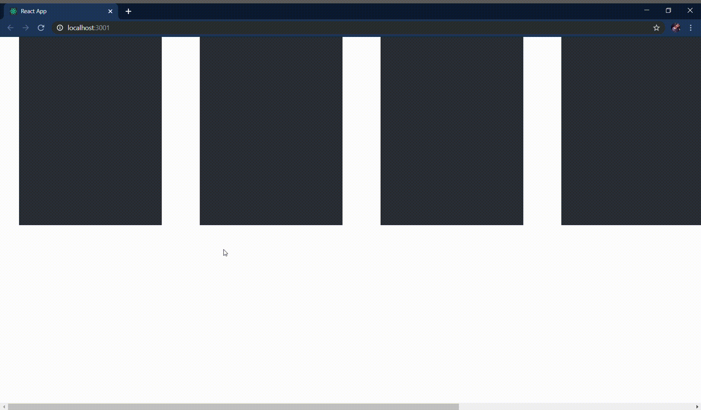
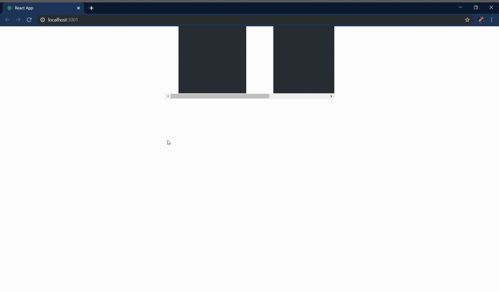

Esses dias eu precisava testar o comportamento de um componente que dependia de um evento de scroll e acabei me batendo muito para encontrar a solução, por isso resolvi escrever esse post.

Imagine que o componente tem o seguinte comportamento: quando é feito um scroll no documento aparece um botão "AVANÇAR".



Para testarmos se o botão vai aparecer na tela temos que simular um scroll, para simular o scroll precisamos fazer o seguinte:

```js
window.dispatchEvent(new window.UIEvent('scroll'))
```

Então o teste fica assim:

```js
// Renderizamos o componente
const { getByText, queryByText } = render(<ScrollDocument />)

// Validamos que o botão "AVANÇAR" não está presente na tela
expect(queryByText(/AVANÇAR/)).not.toBeInTheDocument()

// Simulamos o evento de scroll
window.dispatchEvent(new window.UIEvent('scroll'))

// E validamos que o botão "AVANÇAR" está na tela 
expect(getByText(/AVANÇAR/))
```

Esse teste só vai funcionar se o scroll for o scroll natural do documento, para testar um evento de scroll em uma tag HTML devemos simular o evento diretamente na tag. Então imagine o mesmo comportamento anterior, o botão "AVANÇAR" aparece após um evento de scroll, mas dessa vez o scroll precisa ser feito em uma `DIV`.



O teste fica assim:

```js
// Renderizamos o componente
const { getByText, queryByText, getByTestId } = render(<ScrollDiv />)

// Validamos que o botão "AVANÇAR" não está presente na tela
expect(queryByText(/AVANÇAR/)).not.toBeInTheDocument()

// Aqui pegamos a div por data-testid
const wrapper = getByTestId('scroller-container')

// E aqui simulamos o evento de scroll diretamente na DIV
wrapper.dispatchEvent(new window.UIEvent('scroll'))

// Validamos que o botão "AVANÇAR" está na tela 
expect(getByText(/AVANÇAR/))
```

Se alguém tiver outra maneira de testar esse comportamento pode falar comigo no [twitter](https://twitter.com/eveleww) ou no [linkedin](https://www.linkedin.com/in/evellyn-lima-88638379/).

OBS: Os exemplos de testes demonstrados nesse artigo foram escritos com a biblioteca [@testing-library/react](https://github.com/testing-library/react-testing-library).